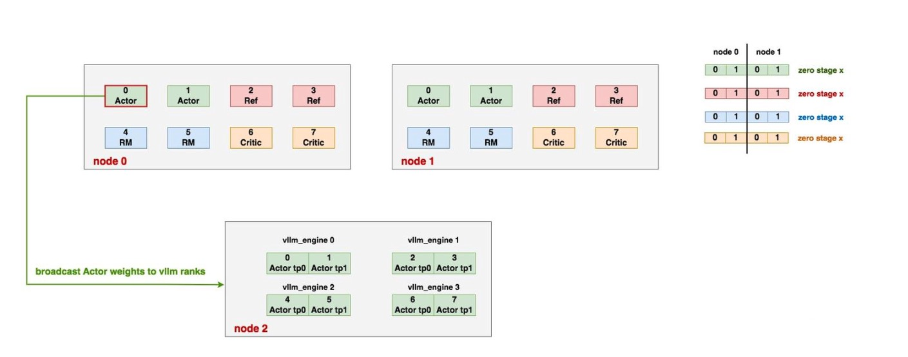
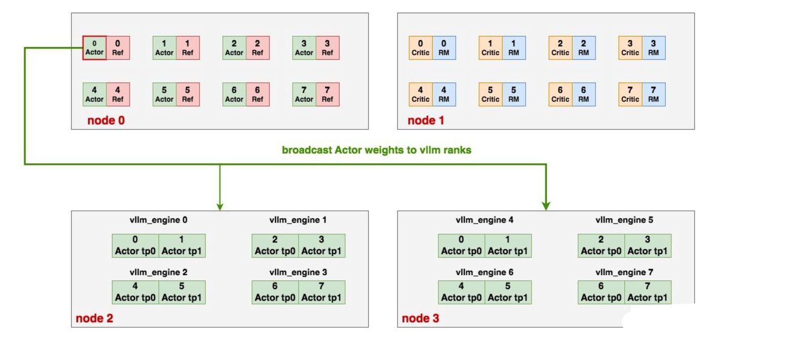
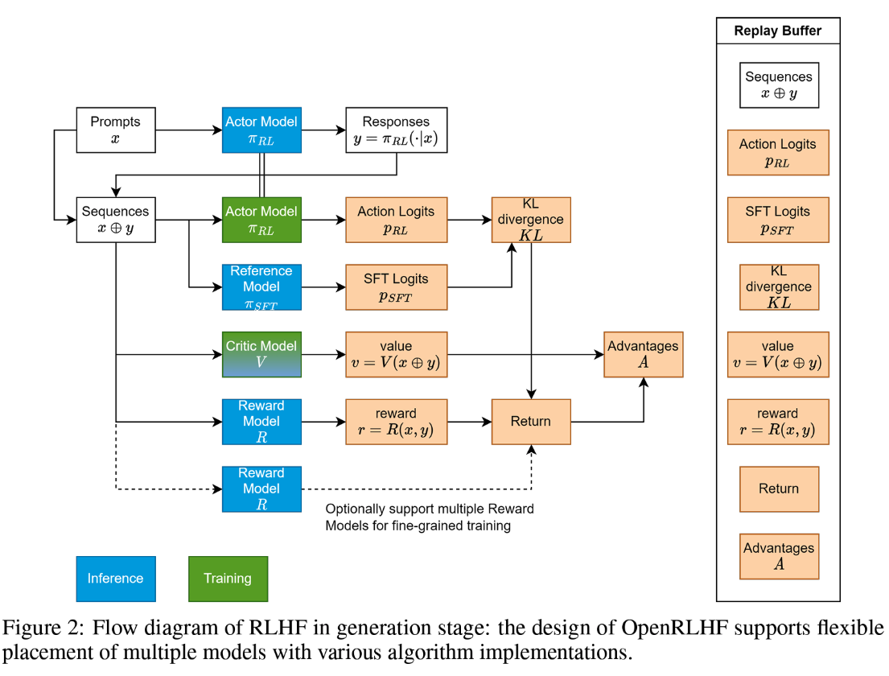

1. https://zhuanlan.zhihu.com/p/677607581
2. https://zhuanlan.zhihu.com/p/24682036412
3. https://github.com/zhaochenyang20/Awesome-ML-SYS-Tutorial/blob/main/rlhf/OpenRLHF/readme.md
4. https://zhuanlan.zhihu.com/p/12871616401

# PPO Pipeline
1. 初始化：SFT model 初始化 Actor，Reward Model 初始化 Critic；
2. Rollout / 生成输出：Actor 对输入的 Prompts 生成相应 / responses。
3. Reward Compute / 计算奖励：Reward Model 对生成的 responses 进行评分，提供 reward 得分。
4. 价值评估与更新：Critic 计算当前 responses 的价值（注意是 value 而非 reward），然后基于 value
   和 reward 计算优势函数（advantage function），最终确定 Actor 的更新方向和幅度。此外，Critic
   也会在这一步进行更新，减少其预测的 value 和实际奖励之间的误差，从而提高下个状态 value 的精度。
5. Advantage funciton 的值最红会用于优化 Actor，同时这步更新需要基于 SFT Model 的 logits 计算
   KL 散度并且加以惩戒，避免 Actor 相较于 SFT model 偏离太远，走到了 Reward Model 的盲点 / blind
   spots 上。

> refer to: https://zhuanlan.zhihu.com/p/12871616401

> refer to: https://zhuanlan.zhihu.com/p/24682036412
>
> 注意，actor 在 RLHF 会进行 auto-regressive decoding，而 critic, reward 和 reference 则只会 prefill，不会 decode。所以，我们将 actor 的推理特定称为 rollout，而其他模型的推理称为 inference。

# DPO Pipeline
1. DPO 是和 PPO 同样声名大噪的对齐方法，这是一种 offline, off-policy 的对齐方法。试图直接将模型对齐成为符合偏好的最佳 policy 而避开了显式需要一个 reward model。这也是其名字的由来：Your Language Model is Secretly a Reward Model。（PS：最近发现有好几个给论文起名的新 pattern，譬如 XXX is All You Need，XXX is Secretly a YYY，XXX Empowers XXX，最后还有 Make XXX Great Again ）
2. 相较于使用隐式的 reward model，DPO 更为激进地选择使用 reference policy 通过 Bradley-Terry Mdel 隐式推导出 chosen / reject pair 之间的 reward。具体来说，通过计算 chosen/ reject pair 之间的对数概率差值来得到 reward，而该差值又由 optimal and reference policies 共同计算。这样的差值又通过 scaling 并且经过 sigmoid 得到最终的 loss。训练过程中，reference policy 固定不动，仅用于构造 chosen / rejected responses。
